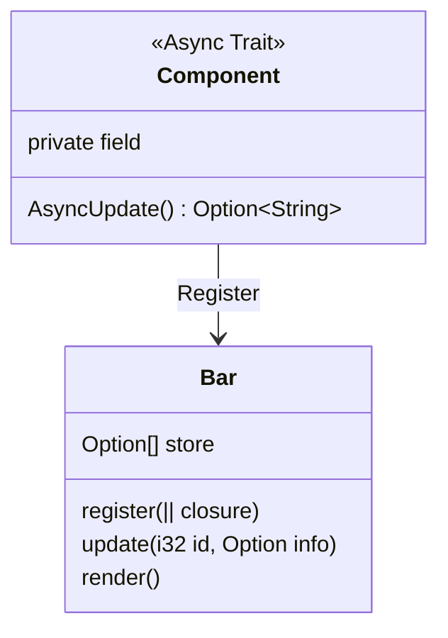
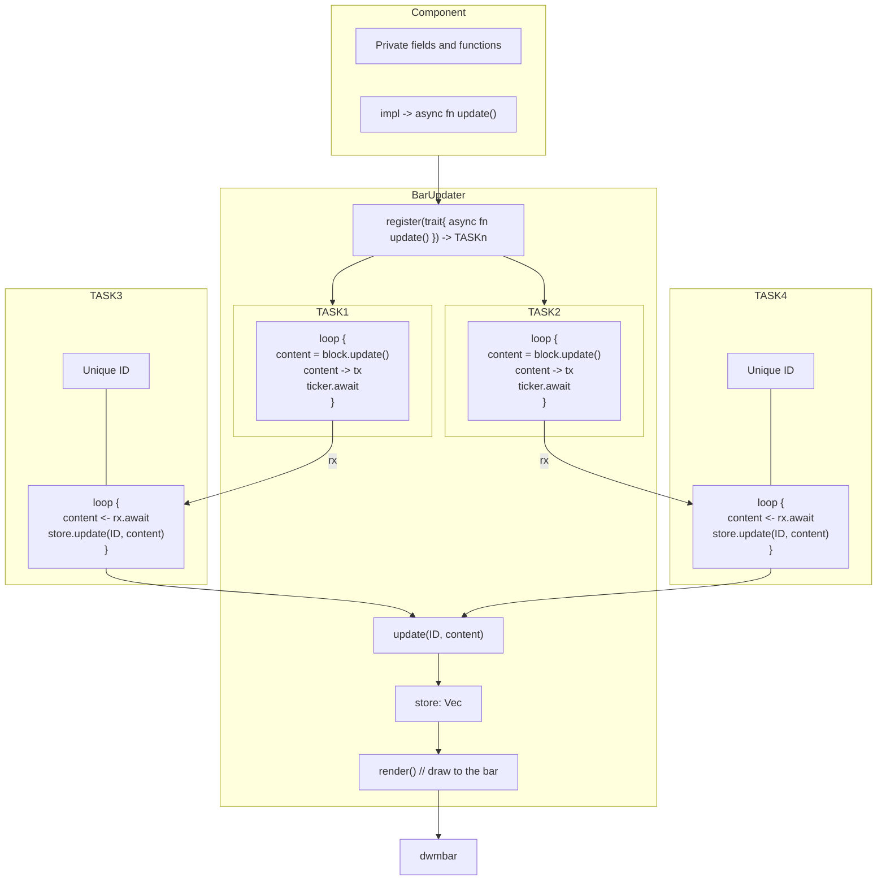

# Design

- Diagram

```mermaid
classDiagram

class Component {
  <<Async Trait>>
  private field
  AsyncUpdate() Option~String~
}

class Bar {
  Option<String>[] store
  register(|| closure)
  update(i32 id, Option<String> info)
  render()
}

Component --> Bar : Register

```

```mermaid
flowchart
  subgraph Component
    field["Private fields and functions"]
    compupdate["impl -> async fn update()"]
  end

  subgraph TASK1
    t1["loop {
      content = block.update()
      content -> tx
      ticker.await
    }"]
  end
  subgraph TASK2
    t2["loop {
      content = block.update()
      content -> tx
      ticker.await
    }"]
  end
  subgraph TASK3
    t4["loop {
      content <- rx.await
      store.update(ID, content)
    }"]
    f4["Unique ID"]
    f4---t4
  end
  subgraph TASK4
    t5["loop {
      content <- rx.await
      store.update(ID, content)
    }"]
    f5["Unique ID"]
    f5---t5
  end

  t1-- rx -->t4
  t2-- rx -->t5

  t4 --> update
  t5 --> update

  Component --> register

  subgraph BarUpdater
    store["store: Vec<String>"]
    store --> render["render() // draw to the bar"]

    update["update(ID, content)"] --> store

    register["register(trait{ async fn update() }) -> TASKn"]
    register --> TASK1
    register --> TASK2
  end

  render --> dwmbar
```
